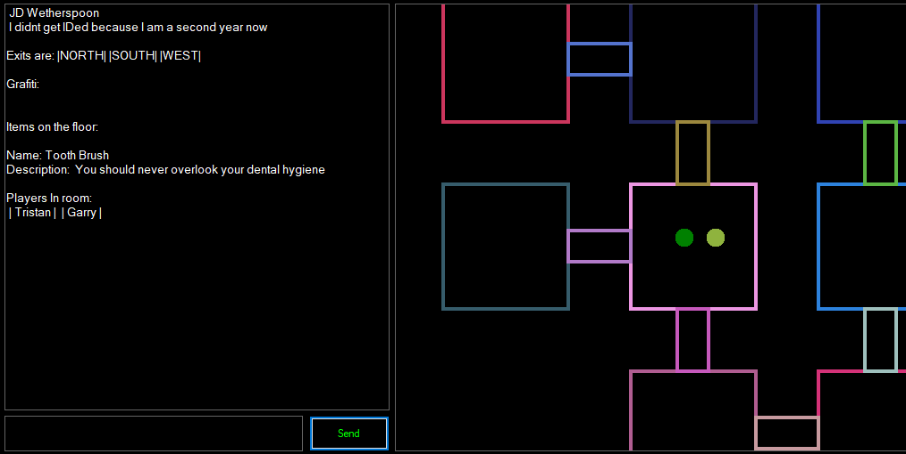

# Multi-User-Dungeon

In this project, I created a client-server application in the form of a Multi-User Dungeon. On the server-side, the MUD was made in C# running on a Digital Ocean server with Ubuntu as its operating system. I used SQLite for the database API to store all of the users' data and the state of the dungeon. All of the messages between the server and the client were encrypted and all passwords were salted and encrypted before being stored. The client was also written in C# using WinForms as the UI API. 

